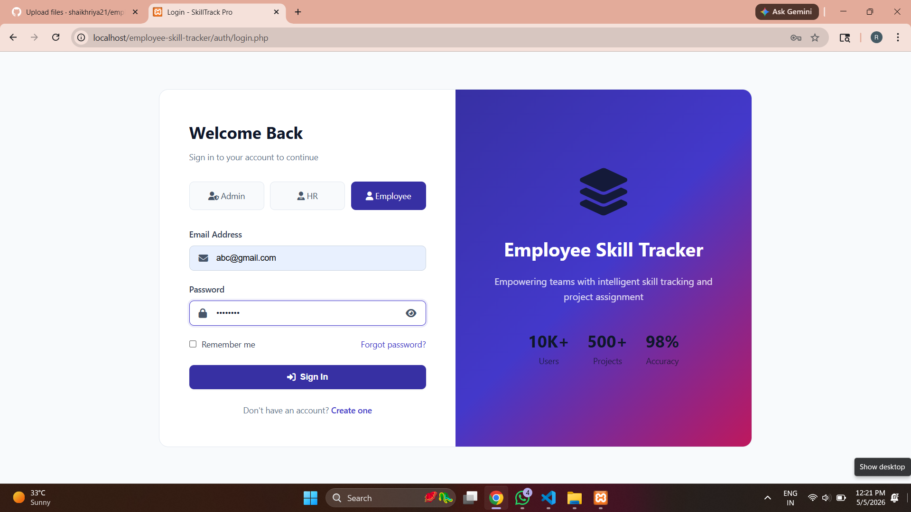
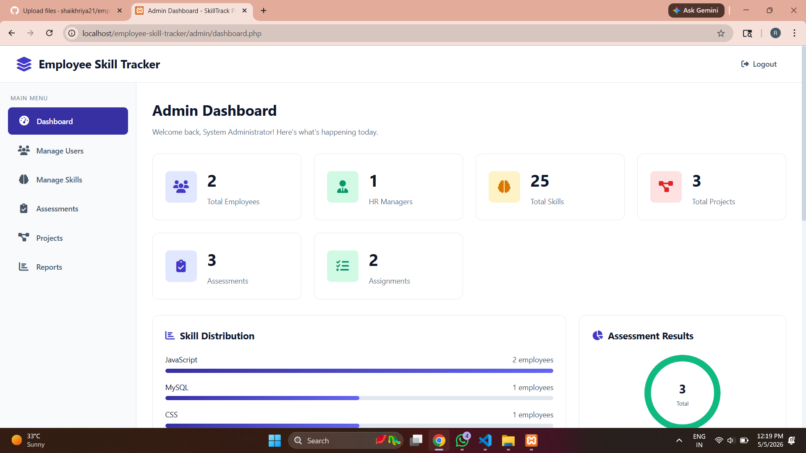
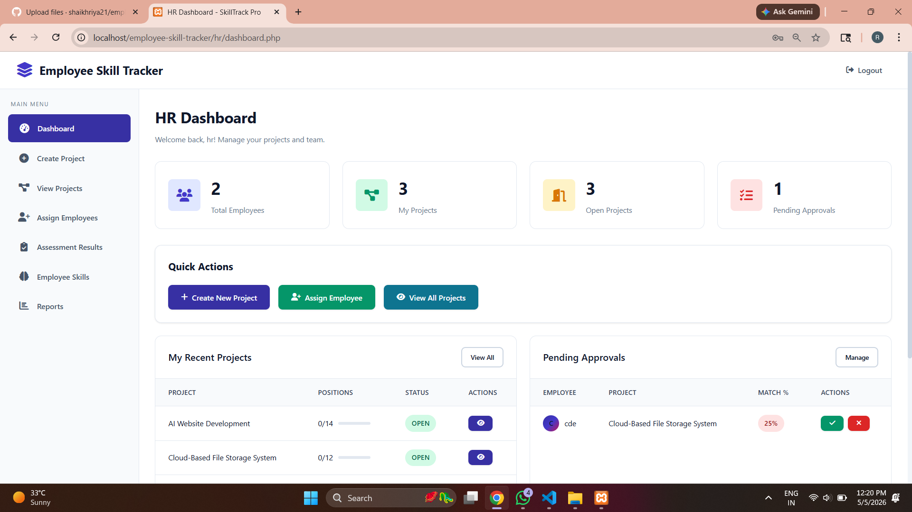
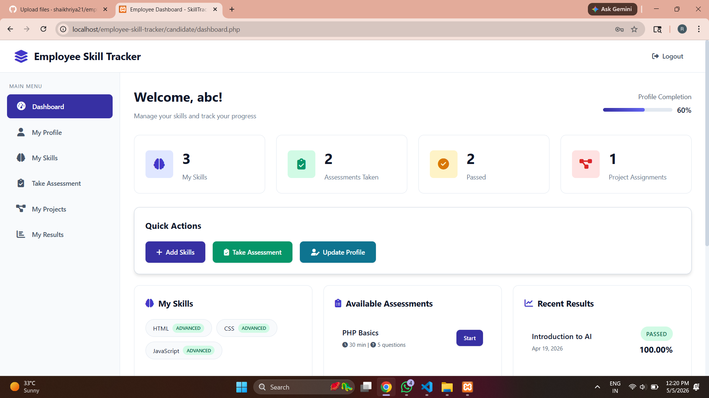
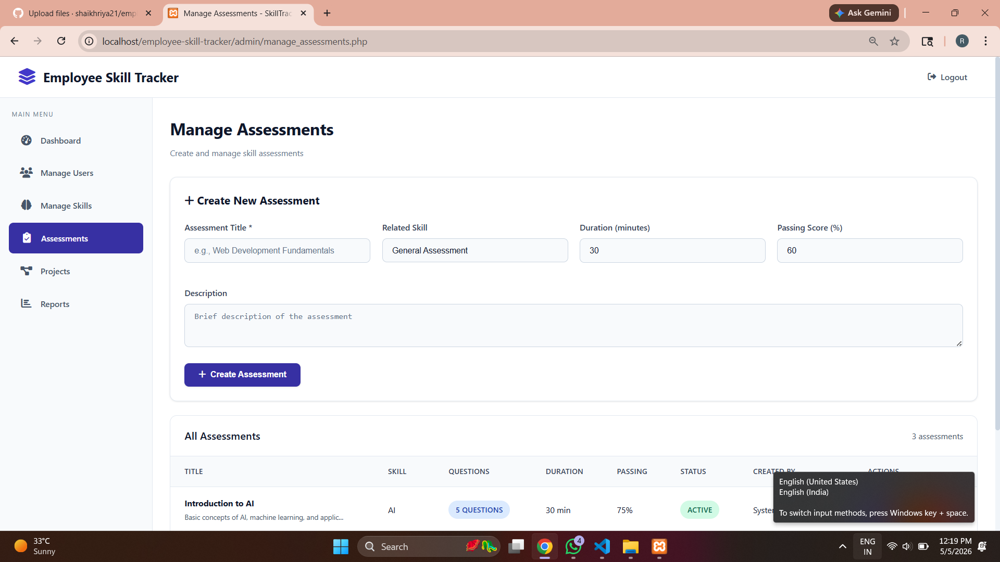

# 🎯 Employee Skill Tracker & Project Assignment System

TYBCA (Science) Project | 2025-2026  
Savitribai Phule Pune University  

A comprehensive PHP-based web application for managing employee skills, conducting assessments, and intelligently matching candidates to projects based on their expertise.

---

## 📸 Screenshots

### 🔐 Login Page


### 📊 Admin Dashboard


### 🟡 HR Dashboard


### 🟢 Employee Dashboard


### 📝 Assessment Page


---

## ✨ Features

### 👤 User Roles
- 🔴 **Admin** — System management, users, skills, reports  
- 🟡 **HR Manager** — Project creation, employee assignment, results  
- 🟢 **Employee** — Profile, skills, assessments, projects  

---

### 🛠️ Core Modules
- User Authentication (bcrypt, role-based access)  
- Skill Management (proficiency + experience)  
- Online Assessments (MCQ, timer, auto scoring)  
- Project Management (skills + positions)  
- Smart Matching Algorithm  
- Reports & Analytics  
- Activity Logging  

---

## 🏗️ Tech Stack
- **Frontend:** HTML5, CSS3, JavaScript  
- **Backend:** PHP  
- **Database:** MySQL  
- **Server:** XAMPP  
- **UI:** Glassmorphism Design  

---

## ⚡ Installation Steps

1. Copy project to XAMPP:
```
C:\xampp\htdocs\employee-skill-tracker
```

2. Start XAMPP:
- Start Apache  
- Start MySQL  

3. Import Database:
- Open: http://localhost/phpmyadmin  
- Import `database.sql`  

4. Run Project:
```
http://localhost/employee-skill-tracker/
```

---

## 🔐 Default Login

| Role | Email | Password |
|------|------|----------|
| Admin | admin@company.com | admin123 |
| HR | hr@company.com | hr123 |

---

## 📂 Project Structure
```
employee-skill-tracker/
│── index.php
│── config/database.php
│── assets/
│── admin/
│── hr/
│── candidate/
│── auth/
│── database.sql
```

---

## 🎯 Key Logic

**Skill Match Formula:**
```
Match % = (Matching Skills / Required Skills) × 100
```

**Auto Selection Criteria:**
- Skill Match ≥ 50%  
- Score ≥ 60%  

---

## 🛡️ Security
- Password hashing (bcrypt)  
- SQL Injection protection  
- XSS protection  
- Session management  
- Role-based access  

---

## 🎓 Academic Details

- **College:** Pratibha College, Pune  
- **University:** SPPU  
- **Course:** TYBCA (Science)  
- **Year:** 2025-2026  

---

## 👩‍💻 Developed By
**Shaikh Riya**  
**Mapari Alfiya**

---

## 🔮 Future Scope
- API Integration  
- Email Notifications  
- AI-based recommendations  
- Chat system  

---

## 📄 License
Academic Project (SPPU)

---

⭐ Star this repository if you like it!
